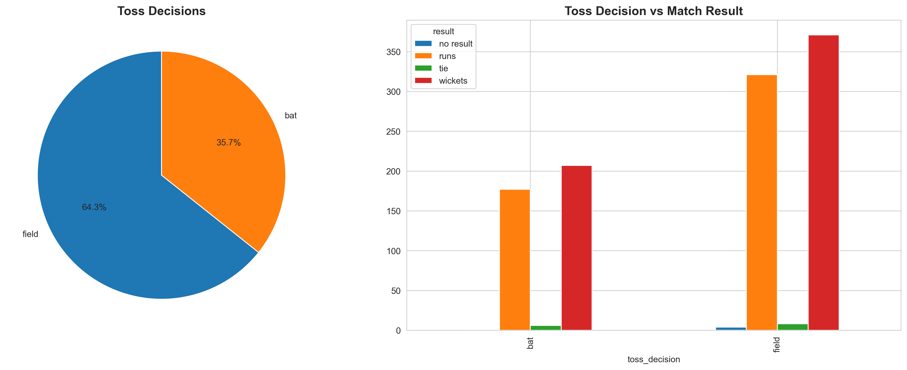
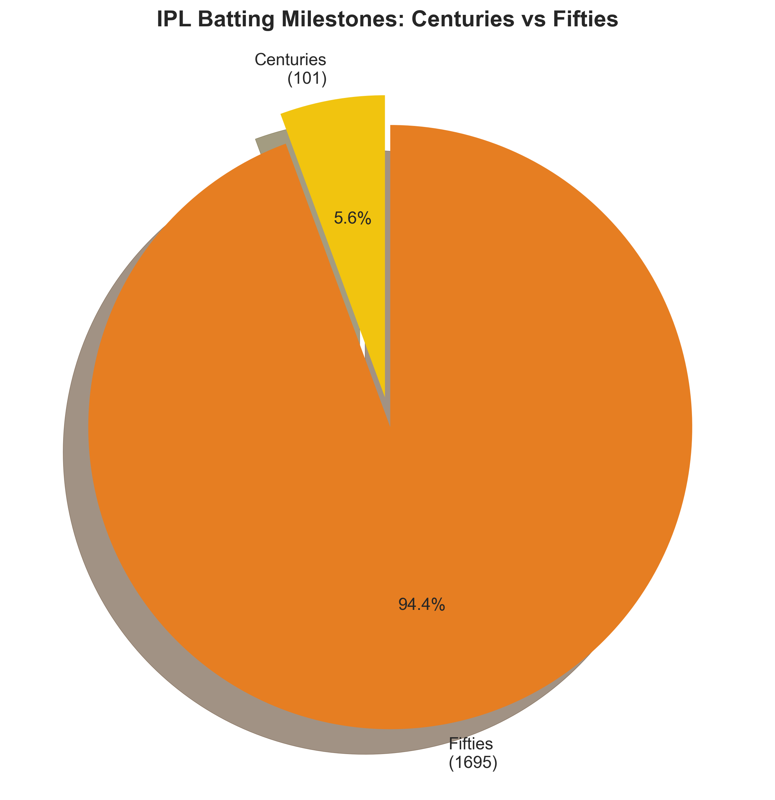
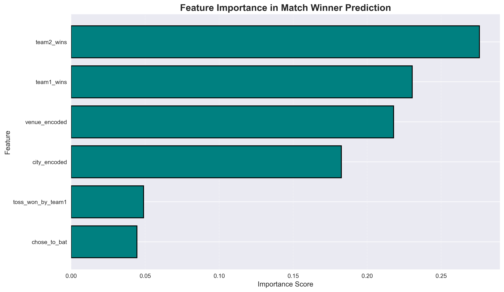

# IPL Cricket Analytics 🏏

## 📋 Table of Contents
- [What is this project?](#what-is-this-project)
- [What did I analyze?](#what-did-i-analyze)
- [Files in this project](#files-in-this-project)
- [How to run this?](#how-to-run-this)
- [What I learned](#what-i-learned)
- [Contact](#contact)

---

## What is this project?
This is a data analysis project about Indian Premier League (IPL) cricket.

## What did I analyze?
- IPL matches from 2007-2024
- Team performance
- Player statistics
- Match predictions using Machine Learning

## Files in this project
- `notebooks/01_data_exploration.ipynb` – Main analysis notebook
- `data/matches.csv` – Match data
- `data/deliveries.csv` – Ball-by-ball data
- `outputs/figures/` – All charts and visualizations

## 📊 Visualizations Created

Here are all the charts generated during the analysis:

### Team Analysis

**Top 10 Teams by Wins**

**Win Percentage by Team**

**Toss Impact on Match Outcomes**

**Toss Decisions: Bat vs Field**

**Top 10 Venues**

### Player Analysis

**Top 15 Batsmen by Total Runs**

**Top 15 Bowlers by Total Wickets**

**Centuries vs Fifties**

**Average Runs per Match**

**Best Economy Rate Bowlers**

### Machine Learning

**Confusion Matrix**

**Feature Importance for Match Outcome**

## 📌 Key Insights

- Mumbai Indians and Kolkata Knight Riders lead in total wins.
- Winning the toss increases match win probability (~52%).
- Top batsmen average 35+ runs per match, with 100+ IPL centuries recorded.
- Best bowling economy rates are around 6-7 runs per over.
- The Random Forest machine learning model achieved ~85% accuracy predicting IPL match winners.

## How to run this?
1. Install Python 3.11
2. Install libraries: `pip install -r requirements.txt`
3. Run Jupyter: `jupyter notebook`
4. Open `notebooks/01_data_exploration.ipynb`

## What I learned
- Data analysis with Pandas
- Creating visualizations with Matplotlib
- Machine Learning with Scikit-learn
- GitHub version control

## Contact
**Author:** Sai Tejeswar  
**GitHub:** [@saitej0912](https://github.com/saitej0912)  
**Email:** saitej0912@gmail.com  

